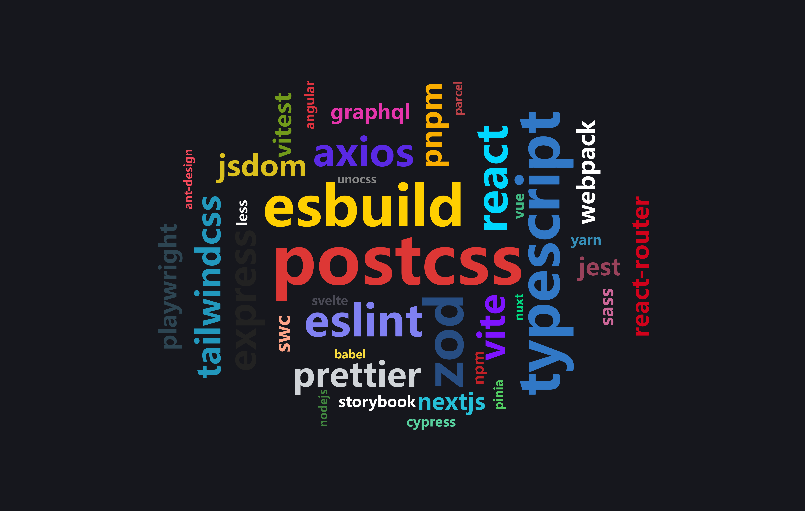

# Frontend Logo Word Cloud

## Background

While learning `unocss`, I came across the online icon library [@iconify-json](https://icones.js.org/), which contains a large collection of icons, including many logos from the frontend ecosystem. That inspired the idea of using AI to turn these logos into a word cloud.

[中文说明](./README_ZH.md)

   

## Feature

- Display a word cloud of frontend technologies
- Support wallpaper download

## Thanks

- [@iconify-json](https://icones.js.org/)
- [echarts-wordcloud](https://github.com/ecomfe/echarts-wordcloud)
- [unocss](https://unocss.dev/)